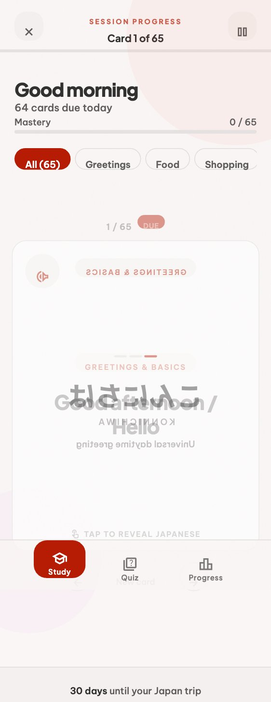
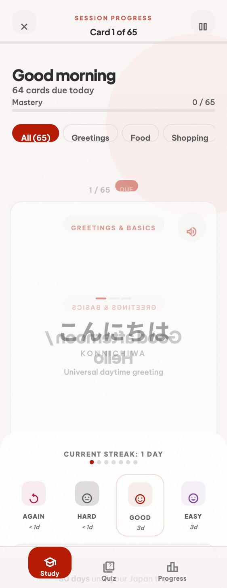
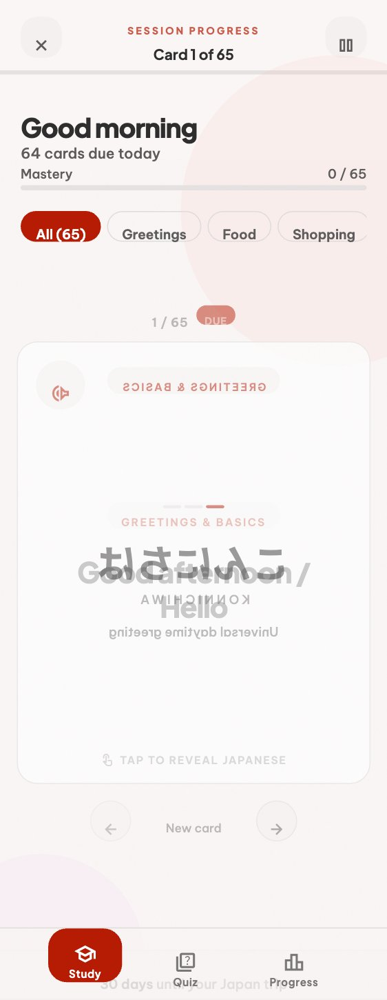
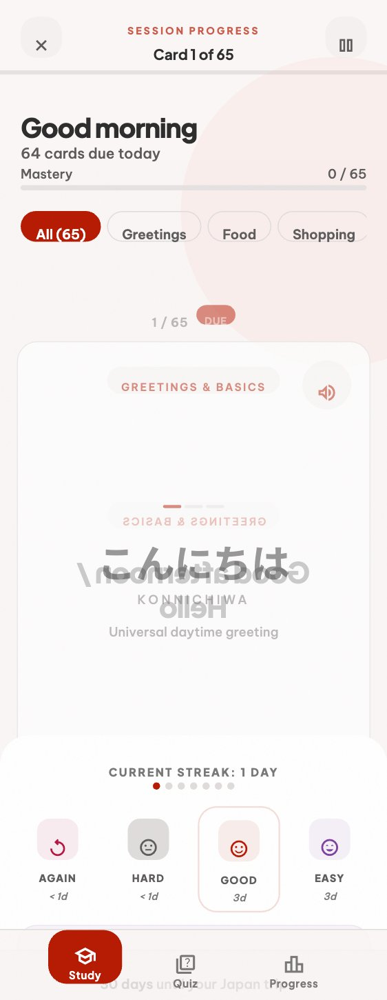
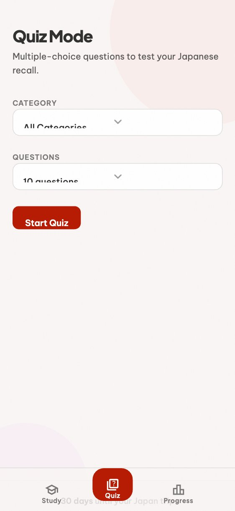
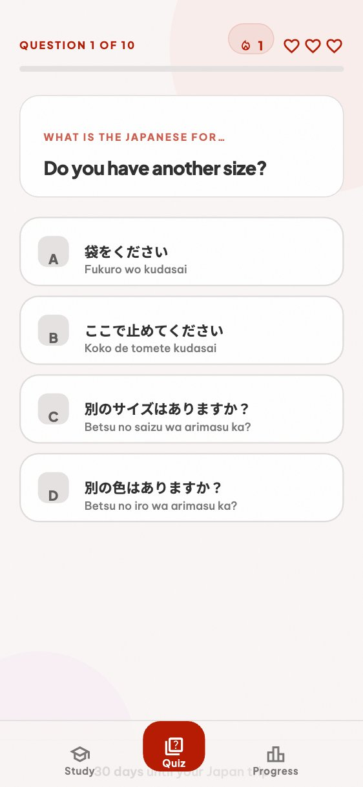
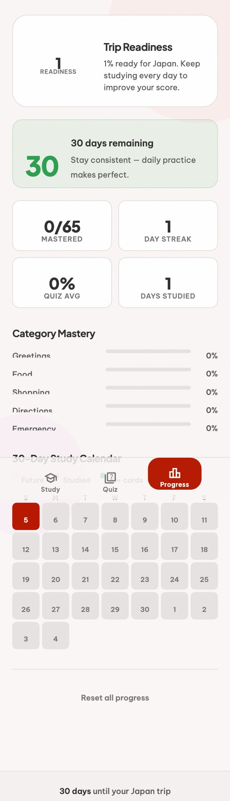

# Tabi Tango — 旅単語

**Journey Words** · A Japanese travel flashcard app with spaced repetition.

Study the 65 most useful phrases for traveling Japan — greetings, food, shopping, directions, and emergencies — using a science-backed SRS algorithm that schedules reviews right when you're about to forget.

🌐 **Live:** [strong-truffle-cc03aa.netlify.app](https://strong-truffle-cc03aa.netlify.app/)

---

## Screenshots

### Study — Desktop

| Front (English prompt) | Back (Japanese answer + grading) |
|---|---|
|  |  |

### Study — Mobile

| Front | Back + Grade Sheet |
|---|---|
|  |  |

### Quiz Mode — Mobile

| Setup | Active Question |
|---|---|
|  |  |

### Progress Tracker — Mobile



---

## Features

- **65 phrases** across 5 categories: Greetings, Food, Shopping, Directions, Emergency
- **Spaced repetition (SRS)** — 4-level grading (Again / Hard / Good / Easy) with SM-2-style intervals
- **3D card flip** — English prompt on front, Japanese + romaji on back
- **Audio pronunciation** — tap the speaker button to hear the phrase via Web Speech API
- **Quiz mode** — multiple-choice with 4 options, auto-advances after answer
- **30-day progress tracker** — study calendar, category mastery bars, trip readiness score
- **Dark mode** — system-aware with manual toggle
- **Keyboard shortcuts** — Space to flip, 1–4 to grade, ← → to navigate
- **Mobile-first** — swipe support, bottom sheet for grading, sticky bottom nav

---

## Tech Stack

Pure static HTML / CSS / JavaScript — no build tools, no framework, no backend.

- **SRS engine** — custom SM-2 implementation in `js/srs.js`
- **Persistence** — `localStorage` (key: `tabitango_v1`)
- **Fonts** — Plus Jakarta Sans, Be Vietnam Pro, Noto Sans JP (Google Fonts)
- **Icons** — Material Symbols Outlined
- **Deploy** — Netlify (auto-deploy on push to `main`)

---

## Local Dev

```bash
python3 -m http.server 3000
# open http://localhost:3000
```

---

## File Structure

```
├── index.html          # Study / flashcard view
├── quiz.html           # Quiz mode
├── progress.html       # 30-day tracker + stats
├── css/
│   ├── main.css        # Design tokens, layout, nav
│   ├── flashcard.css   # 3D flip, card faces, grade buttons
│   ├── quiz.css        # Quiz UI
│   └── progress.css    # Calendar grid, stats
├── js/
│   ├── data.js         # 65 phrases (window.PHRASES)
│   ├── srs.js          # SRS engine + localStorage I/O
│   ├── flashcard.js    # Card rendering, keyboard shortcuts, audio
│   ├── quiz.js         # Multiple-choice quiz logic
│   └── progress.js     # Calendar + stats rendering
└── assets/
    └── favicon.svg     # Torii gate
```
